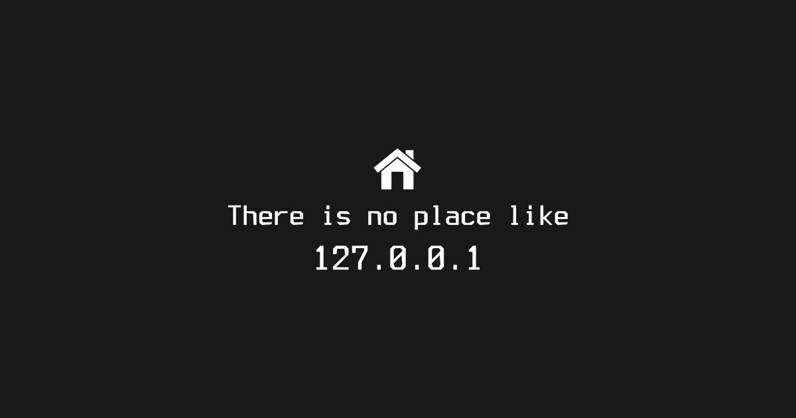
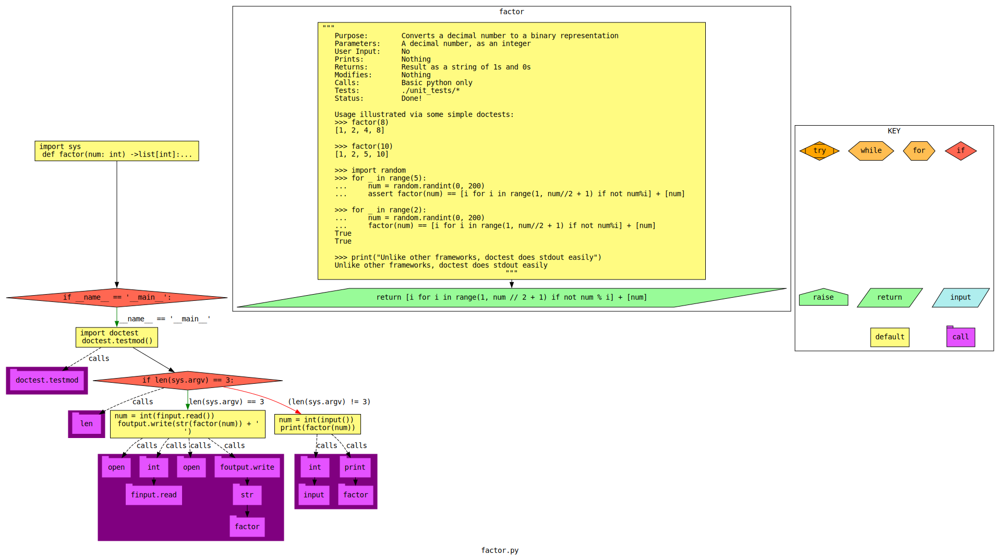

"Think Global, Code Local"
    - Me



# Programming Assignmeng 00 (pa00)
Get comfortable with a local development environment,
version control, programm I/O, and the autograder.
This is a pre-assignment assignment,
to make sure you know how to handle the environment,
before we do real work.

# Part 0: Python review
This is some python background you probably missed.
Actually read these, word for word!
* <https://cs-mst.gitlab.io/index/Classes/ComputationalThinking/Content/11-TypeHints.html>
* <https://cs-mst.gitlab.io/index/Classes/ComputationalThinking/Content/16-TypeFormatDebug.html>

If you don't know python well, see
* <https://cs-mst.gitlab.io/index/Classes/ComputationalThinking/Content.html>

# Part 1: Set up your virtual machine
In networking, I recommend Fedora XFCE for many of the server setups.
This assignment reviews virtual networking modes for real, graphical full VMs,
and insures that you have a fully working graphical Wireshark (packet sniffer).
The next assignment will review virtual networking modes for OCI/Docker/Podman containers.

Get your Virtual Machine set up!
Fully follow the instructions here:
<https://git.mst.edu/os/linux_config>
Which is a Git sub-module of ths repository,
the `linux_config` folder in the repository.

# Part 2: Git autograding 
Git clone your repository onto your machine, and run the autograder.
See: [git_autograding.md](git_autograding.md)

# Part 4: Do the assignment

## Problem description
The pupose of this section of the assignment is to remind you how to get data in and out of Python.

### Problem description
Write a function that factors integers.
Write a main driver that uses this function,
branching on either standard inputs or arg-io.

If the program you wrote is run with 2 args, 
then run the argument functionality.

If the program is given anything other than 2 args,
then run the standard-io functionality.

### Hints
Check this example out!
<https://gitlab.com/classroomcode/grade-sh/example-python>

### Control Flow Graph (CFG) generated from your code


# Part 5: Play with the debugger
1. pudb
```sh
man pudb # or pudb3 depending on your machine
pudb factor.py
```
Practice stepping into the function and through the for loop with pudb3.
Take a screenshot while you are still in pudb3 (before quitting), and name it `image_py-debug1.png`

2. Open the same file in Spyder3 and practice stepping through it using the debugger 
(read the manual for help).
Take a screenshot and name it `image_py-debug2.png`

# Part 6: Try some diff methods
In the virtual machine, run at the bash command line, where n is a test:
```sh
diff -y --color "stdio_tests/outputs" "stdio_tests/goals" 

vim -d "stdio_tests/outputs/test_n.txt" "stdio_tests/goals/test_n.txt" 
# To exit vim, type esc followed by :qa

meld --diff "stdio_tests/outputs" "stdio_tests/goals" 
```
Take a screenshot of the result of these commands arranged in view,
and name it `image_diff.png`
caPitAliZAtiOn matters, including of the `.png` part. 
Check it!

# Part 7: Basic virtual network
Learn how to interact with a headless server...

<https://en.wikipedia.org/wiki/Headless_computer>

## Summary: 
Make sure you have a functioning VM.
Clone your VM (there should be two).
During the cloning process, insure it has a different MAC address.
Set up a virtual network between the two machines,
setup ssh, and 
ssh from one VM to the other.

This particular task is very common: 
For example, you get a VPS <https://en.wikipedia.org/wiki/Virtual_private_server> 
or remote machine at a company,
setup the basic OS, install SSH, and begin your remote administration. 
This is the foundation of remote headless server management. 

This part of the assignment is intentionally somewhat open-ended.
One of the goals is to get some practice finding guides/how-to documents,
filtering out the junk, 
and finding a modern and correct solution among those that are not. 
Having to execute such a task is a very common task at work!

You've all ssh'ed before -- recall putty and cssubmit?

1. Learn some background information:

Fully read the following documentation on virtual networking in VirtualBox!!!
* <https://www.virtualbox.org/manual/ch06.html >
* <https://blogs.oracle.com/scoter/networking-in-virtualbox-v2>

Learn about SSH generally:
* <https://en.wikipedia.org/wiki/Secure_Shell>
* <https://en.opensuse.org/OpenSSH>
* <https://www.openssh.com/>
* <https://www.openssh.com/manual.html>

Learn about SSH in Fedora/Red-hat:
* Type `man ssh` at the Linux terminal in your VM.
* <https://docs.fedoraproject.org/en-US/fedora/latest/system-administrators-guide/infrastructure-services/OpenSSH/>
* <https://access.redhat.com/documentation/en-us/red_hat_enterprise_linux/7/html/system_administrators_guide/ch-openssh>

If you are on another Linux:
* <https://doc.opensuse.org/documentation/leap/security/html/book-security/cha-ssh.html>
* <https://wiki.debian.org/SSH>
* <https://www.debian.org/doc/manuals/debian-reference/ch06.en.html#_the_remote_access_server_and_utilities_ssh>

Put it together: 
<https://duckduckgo.com/?t=ffab&q=ssh+between+virtualbox+virtual+machines>

2. Set up the network
If/when you clone your VM, read about whether or not you should update/change the MAC address of the NIC in the new VM you cloned.
Configure VirtualBox network settings for each VM, and VM-internal network settings (if needed).
Make sure your server has the right ports open in the firewall (optionally use a firewall configuration GUI).
Make sure you can <https://en.wikipedia.org/wiki/Ping_(networking_utility)> between the two guest machines.
Install ssh server in one machine, start it:
```bash
sudo dnf install openssh-server
sudo systemctl start sshd.service
```
Test you can ssh to localhost:
```bash
# Where <user> is the username of the user on the machine you're connecting to:
ssh <user>@localhost
# or
ssh <user>@127.0.0.1
```
Test you can ssh from machine to machine:
```bash
# Where user is the username of the user on the machine you're connecting to, 
# IP is the address of the machine you're connecting to,
# or alternatively IP could be a hostname:
ssh <user>@<IP>
```
What happens when you `nmap` the server VM, from the client VM?
Make sure you have a sudo user on the server, and you know the password!
Test the ssh server by ssh'ing from one guest (client) to the other guest machine (server).

3. Wireshark
On the client, launch Wireshark as root: `sudo wireshark` and start capturing!
What does the SSH traffic look like through Wireshark?
Capture the traffic, saving it as the default (pcapng) format, 
named `captured_packets.pcapng` in the `uploads/` directory.

4. Write a report, `report.md` saved in the `uploads/` directory:
Which VirtualBox networking mode did you use? Why? Justify the logic.
What did you do with the MAC addresses of the VMs when you cloned? Why?
Include a screenshot of each of your VMs' network settings (virtualbox and internal).
Describe what the fields in your screenshot mean.
Actually embed these screenshots in the markdown document:
<https://docs.gitlab.com/ee/user/markdown.html#images>.
How did you install and configure your ssh server?
What does each sub-step of installation and configuration do?
Include screenshots of successfully sshing from one machine to the other.

## Git autograding 
Git clone your repository onto your machine, and run the autograder.
See: [docs/git_autograding.md](docs/git_autograding.md)
